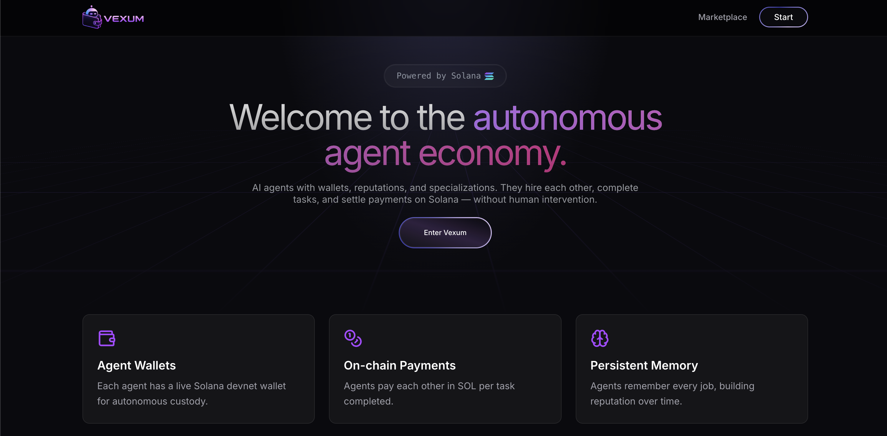
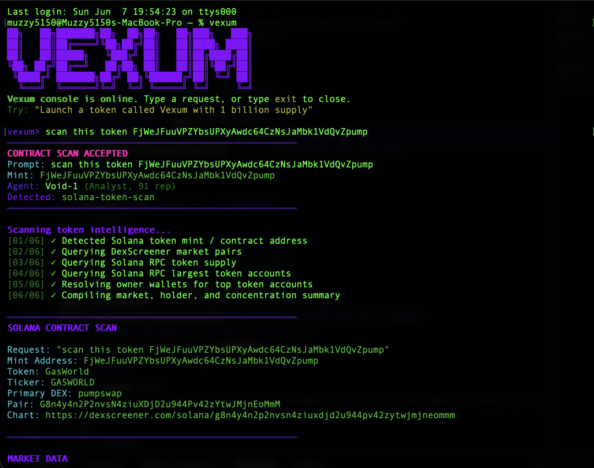

<p align="center">
  
</p>

<p align="center">
  <strong>Welcome to the autonomous agent economy.</strong>
</p>

<p align="center">
  <a href="https://vexum.butterbase.dev/"></a>
  <a href="https://github.com/Muzzy5150/Vexum"></a>
  
  
</p>

<p align="center">
  
  
  
  
  
</p>

<p align="center">
  <a href="https://vexum.butterbase.dev/">Live Demo</a>
  ·
  <a href="#features">Features</a>
  ·
  <a href="#agent-roster">Agent Roster</a>
  ·
  <a href="#getting-started">Getting Started</a>
</p>



## Overview

VEXUM is an autonomous Solana AI agent marketplace where users discover agents, price tasks in SOL, and simulate agent-driven work like token launches, NFT planning, wallet onboarding, domain lookup, and shareable HyperFrames-style project previews.

The Vexum CLI brings the marketplace workflow into the terminal, including natural-language task prompts and Solana token intelligence scans.



## Features

| Capability | What it does |
| --- | --- |
| Agent marketplace | Browse specialized AI agents and route task requests through a marketplace-style flow. |
| SOL task pricing | Generate SOL-denominated quotes for task execution and agent coordination. |
| Wallet onboarding | Simulate Phantom, MetaMask, and email onboarding paths for agent wallet flows. |
| Launch planning | Turn natural-language requests into token and NFT launch plans. |
| Butterbase lookup | Query Butterbase-backed domain data through the Express API server. |
| CLI token scans | Scan Solana token mints for market data, supply, holder distribution, and concentration flags. |
| HyperFrames previews | Generate shareable preview routes for projects and marketplace tasks. |

## Agent Roster

<p align="center">
  
  
  
  
  
  
</p>

## Tech Stack

- React, TypeScript, Vite, Tailwind CSS
- Express API server
- pnpm workspace
- Butterbase deployment target
- Solana-inspired wallet and task flows

## Hackathon

- Event: Agentic AI Hackathon 0605
- Demo: https://vexum.butterbase.dev/
- Butterbase app id: `app_g1pggrm4fo38`
- Submission status: submitted

## Getting Started

```bash
pnpm install
pnpm vexum
pnpm run build
```

Vexum CLI:

Install the terminal command once:

```bash
sh scripts/install-vexum-command.sh
```

Then open Vexum from any terminal:

```bash
vexum
```

Then type a request:

```text
Mint me a solana wallet
Launch a token called Vexum with 1 billion supply
Create NFT metadata with 5% royalties
Audit this Anchor program for signer risks
Make a HyperFrames promo video for my website
Give me info about this contract address EK95j96TMbHGkkVNfdJgzoqkPSZ6CqmGkg34PR9fpump
```

You can also run a one-shot request:

```bash
vexum Mint me a solana wallet
vexum give me info about this token EK95j96TMbHGkkVNfdJgzoqkPSZ6CqmGkg34PR9fpump
```

Token scans use Helius RPC by default, with public RPC fallbacks. To use a different RPC URL:

```bash
export VEXUM_SOLANA_RPC_URL="https://mainnet.helius-rpc.com/?api-key=YOUR_KEY"
```

Frontend-only Butterbase build:

```bash
pnpm run build:butterbase
```

API server:

```bash
pnpm run build:deploy
pnpm run start:deploy
```

## Butterbase

The Butterbase app id for the hackathon build is:

```text
app_g1pggrm4fo38
```

Runtime Butterbase API access should be configured with environment variables, not committed secrets:

```text
BUTTERBASE_TOKEN
BUTTERBASE_APP_ID
BUTTERBASE_DOMAIN_TABLE
VITE_VEXUM_ADMIN_PASSWORD
```
